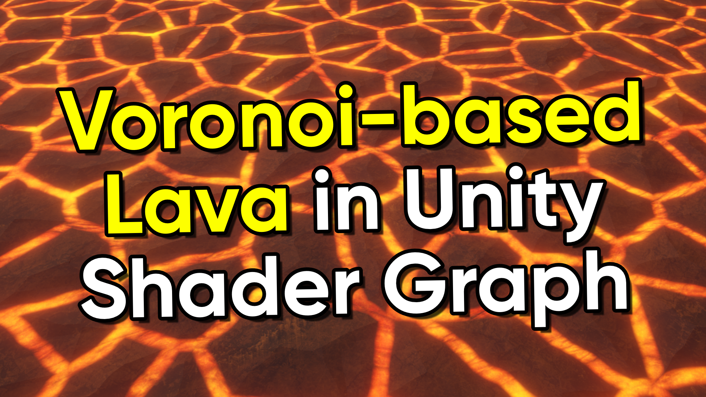

# Voronoi-based Lava in Unity Shader Graph

A stylised lava effect which uses a Voronoi pattern as its base.

## Overview

Voronoi patterns are extremely useful for creating natural cell-like patterns in computer graphics. Unity Shader Graph comes with a Voronoi node, but it doesn't provide enough information about the edges between the cell regions, so you'll need to create a custom node to do so. From there, you can create all kinds of effects, including the lava effect contained in this repository.

## Software

This project was created using Unity 2022.3.0f1 (Long-Term Support).

## Tutorials

This project is part of a tutorial which is available in the following places:

## Authors

This project and the corresponding tutorials were created by Daniel Ilett.

## Release

This project was released on June 20th 2023.
